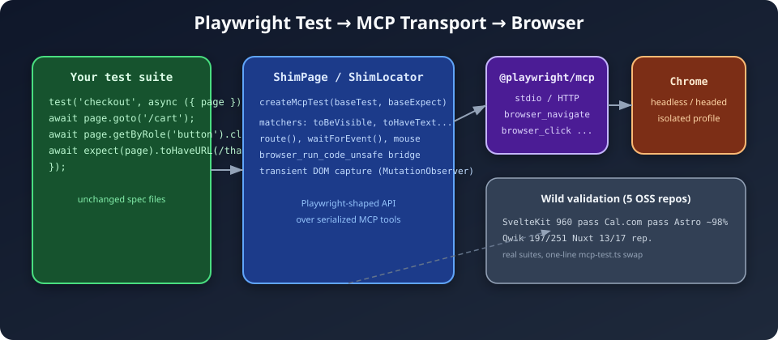
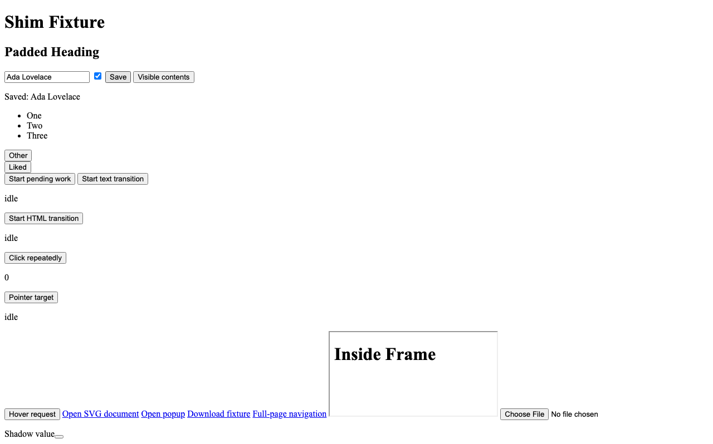

# playwright-mcp-transport-experimental

> **What if your Playwright tests didn't talk to Chrome over CDP — but over MCP instead?**

This repo is the story of that experiment: an experimental Playwright Test extension that drives a real browser through [`@playwright/mcp`](https://github.com/microsoft/playwright-mcp) (Model Context Protocol / stdio) instead of Playwright's native page transport.

The goal was not to replace Playwright. It was to answer a sharper question:

**Can existing Playwright e2e suites keep their specs, matchers, and fixtures — and swap only the transport layer underneath?**

We built a shim, ran it against our own integration fixture, then threw five large OSS repos at it. This README is the lab notebook.

---

## The hypothesis

MCP is becoming the lingua franca for agent ↔ tool communication. Playwright already ships an MCP server that exposes browser primitives (`browser_navigate`, `browser_click`, `browser_snapshot`, …). If we could make Playwright Test *think* it still had a normal `page` fixture, we could:

1. Reuse thousands of lines of existing e2e tests with a one-file import swap.
2. Let agents and humans share the same browser automation surface.
3. Learn where MCP's serialized, snapshot-based model breaks down compared to CDP.

Spoiler: **it mostly works** — with caveats you'll want to know about before adopting.

---

## Architecture



| Layer | What it is | Role |
|-------|------------|------|
| **Your specs** | Unchanged `test()` / `expect()` files | Business logic, selectors, assertions |
| **Shim** (`ShimPage`, `ShimLocator`, `createMcpTest`) | Playwright-shaped adapter | Translates `page.goto`, matchers, routing, events into MCP tool calls |
| **`@playwright/mcp`** | Managed stdio server (per test) | Launches an isolated browser profile, exposes tools |
| **Chrome** | Headless or headed | The actual rendering engine |

Data flows **one MCP call at a time**. There is no persistent CDP session inside your test process — every click is a round trip.

---

## A day in the life of a test

### 1. You write normal Playwright

```ts
test('checkout', async ({ page }) => {
  await page.goto('/cart');
  await page.getByRole('button', { name: 'Pay' }).click();
  await expect(page).toHaveURL(/thanks/);
});
```

### 2. Your repo swaps the import — not the spec

Create `mcp-test.ts` beside your specs:

```ts
import { test as base, expect as baseExpect } from '@playwright/test';
import { createMcpTest } from 'playwright-mcp-transport-experimental/dist/shim/factory.js';

const mcp = createMcpTest(base, baseExpect);
const useNative = process.env.PLAYWRIGHT_MCP_TRANSPORT === 'native';

export const test = useNative ? base : mcp.test;
export const expect = useNative ? baseExpect : mcp.expect;
```

Then in every spec:

```diff
- import { test, expect } from '@playwright/test';
+ import { test, expect } from './mcp-test';
```

Toggle back to native Playwright any time with `PLAYWRIGHT_MCP_TRANSPORT=native`.

### 3. `createMcpTest` spawns MCP and returns a shim page

Under the hood, each test gets a managed `@playwright/mcp` process:

```ts
// src/options.ts — defaults when you don't override mcpOptions
args: ['@playwright/mcp@latest', '--headless', '--snapshot-mode=none', '--isolated']
```

The shim wires Playwright fixtures (`baseURL`, `viewport`, `timezoneId`, …) into MCP's `contextOptions` so Cal.com doesn't suddenly show a "confirm your timezone" dialog that native Playwright never triggered.

### 4. Integration proof: real MCP, real browser

This is not mocked — the integration suite boots a static HTTP server (MCP blocks `file://`), spawns `@playwright/mcp`, and exercises the full shim stack:

```ts
// tests/integration/shim-flow.spec.ts (excerpt)
await page.goto(`${fixturesUrl}/shim.html`);
await page.getByTestId('name-field').fill('Ada');
await page.locator('#save-btn').click();
await expect(page.locator('#status')).toHaveText('Saved: Ada');
```



*The fixture page after fill + click — the same HTML our integration tests drive through MCP.*

---

## Watch it run

### Unit tests (61 passing)

Fast, mocked transport — matchers, selector construction, snapshot parsing, route-handler wiring.


<details>
<summary>asciicast source</summary>

Play the raw cast with [asciinema](https://asciinema.org/) or render your own GIF:

```bash
asciinema play docs/assets/unit-tests.cast
agg docs/assets/unit-tests.cast docs/assets/unit-tests.gif
```

</details>

### Integration smoke (real `@playwright/mcp` stdio)

One test, ~18 seconds — mostly MCP server cold start.


### Wild validation sweep (five OSS repos)

We cloned Astro, SvelteKit, Nuxt, Qwik, and Cal.com into a sibling `mcp-wild-validation/` workspace, added `mcp-test.ts` wrappers, cranked timeouts to `180s`, set `workers: 1`, and ran their real suites.


---

## Wild validation: what happened

These numbers are from **September 2026** representative runs after iterative shim fixes. They are not a permanent CI badge — they document what we observed while stress-testing the transport.

| Repo | Result | Highlights |
|------|--------|------------|
| **SvelteKit** | **960 passed**, 26 skipped, 0 failed | Full JS-enabled project sweep. Strongest signal that the shim is production-shaped for large suites. |
| **Cal.com** | Core paths green | Auth flows, event-types, file uploads via native bridge. Avatar upload excluded (upstream flake under both transports). |
| **Astro** | **424 passed**, 4 skipped, 6 failed | Six residual failures pass in isolation. `view-transitions` fails **identically under native Playwright** (`beforeAll` dev-server warmup timeout) — environment, not MCP. |
| **Qwik** | **197 / 251** in core sweep | Cold `webServer` + per-test MCP spawn = slow (~55s smoke). Two timing failures (`effect-client`, `resource`). |
| **Nuxt** | **13 / 17** representative | Fixture `tsconfig` gaps, favicon 404 console noise, rapid `dispatchEvent` under serialization. |

### Lessons from the field

1. **One import swap is enough** — no spec rewrites for the repos above.
2. **`workers: 1` is not optional** today — each test spawns an isolated MCP browser; parallel workers collide on profiles and ports.
3. **Timeouts must reflect reality** — MCP adds seconds per action; a repo's `expect: { timeout: 5000 }` will lie to you.
4. **Some failures are transport-agnostic** — when native Playwright fails the same way, stop blaming the shim.
5. **Serialization changes timing** — transient DOM, hover-triggered fetches, and counter increments are where flakes cluster.

---

## Two APIs: pick your depth

### Shim API (most adopters)

```ts
import { createMcpTest } from 'playwright-mcp-transport-experimental/dist/shim/factory.js';

const { test, expect } = createMcpTest(base, baseExpect);
```

`ShimPage` implements the Playwright surface area real suites need: locators, matchers, `route()`, `waitForEvent()`, popups, downloads, file choosers, `page.request`, CDP sessions via `browser_run_code_unsafe`, and transient DOM observation for micro-updates MCP snapshots would otherwise miss.

### Lower-level `McpPage` API

```ts
import { createMcpTest } from 'playwright-mcp-transport-experimental';

const { test, expect, mcpPage } = createMcpTest();
await mcpPage.goto('https://example.com');
await mcpPage.locator('body').click();
await expect(mcpPage.locator('h1')).toBeVisible();
```

Closer to the MCP tool layer — useful for probing server capabilities, less for dropping into an existing suite.

---

## How the shim bridges the gap

MCP exposes **accessibility snapshots**, not a live DOM. The shim compensates:

| Playwright feature | Shim strategy |
|--------------------|---------------|
| `getByRole` / `getByText` | Parse `browser_snapshot` YAML, match role + name |
| `toHaveText` / `toBeVisible` | Poll snapshots + `browser_verify_*` tools; respect `expect.timeout` from config |
| Transient attribute/HTML changes | `MutationObserver` via `browser_run_code_unsafe` |
| `page.route()` | Native Playwright bridge inside the MCP process |
| File uploads | Native `setInputFiles` bridge |
| Matchers after dynamic `expect.extend` | Re-register custom matchers on shim `expect` (see Qwik wrapper) |

The native bridge is the escape hatch: when MCP tools can't express an operation, we run real Playwright code *inside* the MCP server's browser context.

---

## Known limits (read before adopting)

- **`javaScriptEnabled: false`** — unsupported; the shim depends on in-page evaluation.
- **Per-test MCP spawn** — slow; no shared browser pool yet.
- **Serialized calls** — no true parallel actions within a test; timing-sensitive tests may flake.
- **Incomplete surfaces** — `dialog` events, full `browser`/`request` fixtures, some `route` abort/fulfill paths after inspection.
- **Hardcoded dist paths** in wild-validation wrappers — point `createMcpTest` at your built package until this is published.

---

## Getting started

```bash
git clone <this-repo>
cd playwright-mcp-transport-experimental
npm install
npm run build
npm test                  # typecheck + 61 unit tests
npm run test:integration  # 57 integration tests against real @playwright/mcp
```

### Recommended Playwright config for MCP suites

```ts
// playwright.config.ts
export default defineConfig({
  workers: 1,
  timeout: 180_000,
  expect: { timeout: 30_000 },
  use: {
    actionTimeout: 60_000,
    navigationTimeout: 60_000,
  },
  webServer: {
    command: 'npm run dev',
    url: 'http://localhost:3000',
    timeout: 180_000,
    reuseExistingServer: !process.env.CI,
  },
});
```

### Regenerating README terminal GIFs

```bash
npm run test:unit 2>&1 | tee docs/assets/unit-tests-output.txt
node docs/scripts/text-to-asciicast.mjs docs/assets/unit-tests-output.txt docs/assets/unit-tests.cast
agg docs/assets/unit-tests.cast docs/assets/unit-tests.gif
```

---

## Project layout

```
src/
  tool-client.ts      # MCP stdio/HTTP client
  page.ts, locator.ts # Lower-level McpPage API
  shim/               # Playwright-compatible adapter (the main event)
    factory.ts        # createMcpTest(), createShimPage()
    page.ts           # ShimPage
    locator.ts        # ShimLocator
    matchers.ts       # expect() matchers
tests/
  unit/               # Fast, mocked transport
  integration/        # Real @playwright/mcp server + fixtures/
docs/assets/          # Architecture diagram, screenshots, asciinema casts & GIFs
```

---

## Status

**Experimental.** The shim is broad and battle-tested against real OSS suites, but MCP transport is inherently slower and less capable than native CDP for some patterns.

If you're exploring agent-driven testing, shared browser tooling, or "can MCP replace my wire protocol?" — this repo is a honest answer with numbers, not slides.

---

## License

MIT
